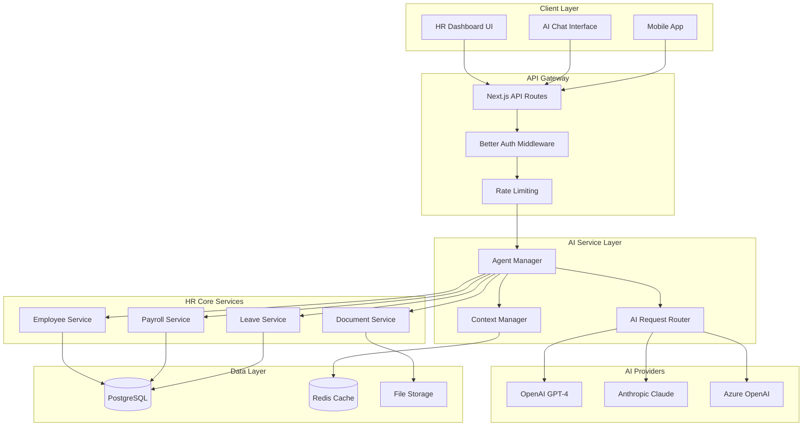
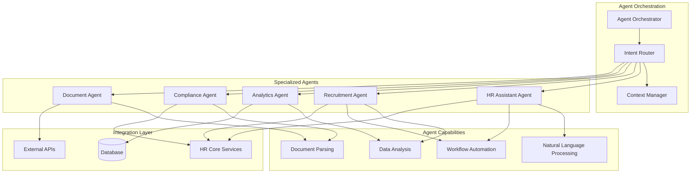
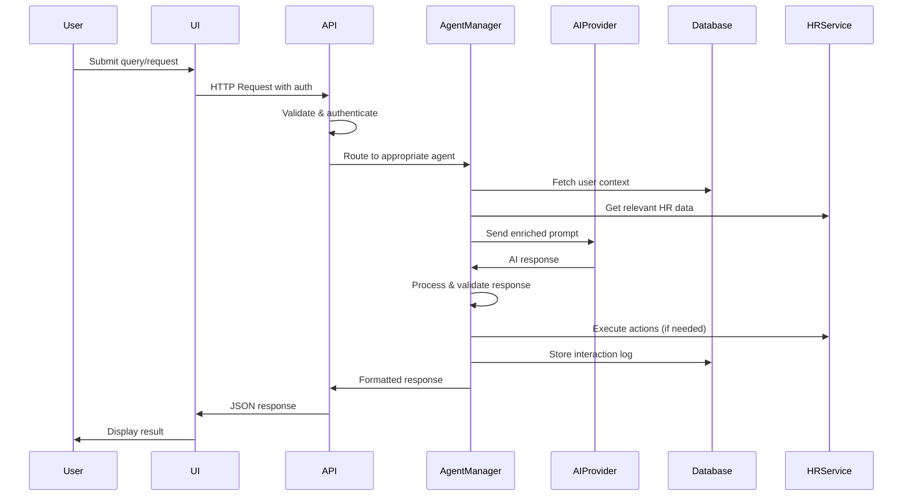
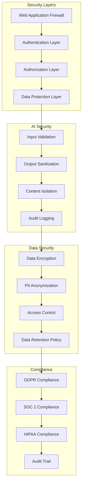
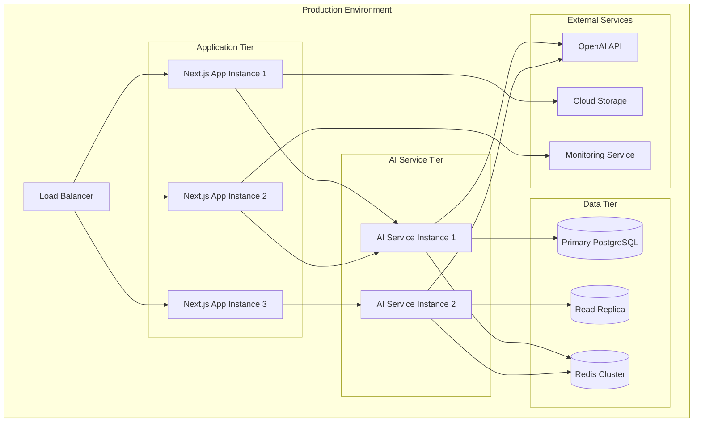
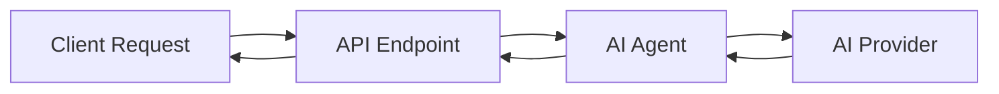
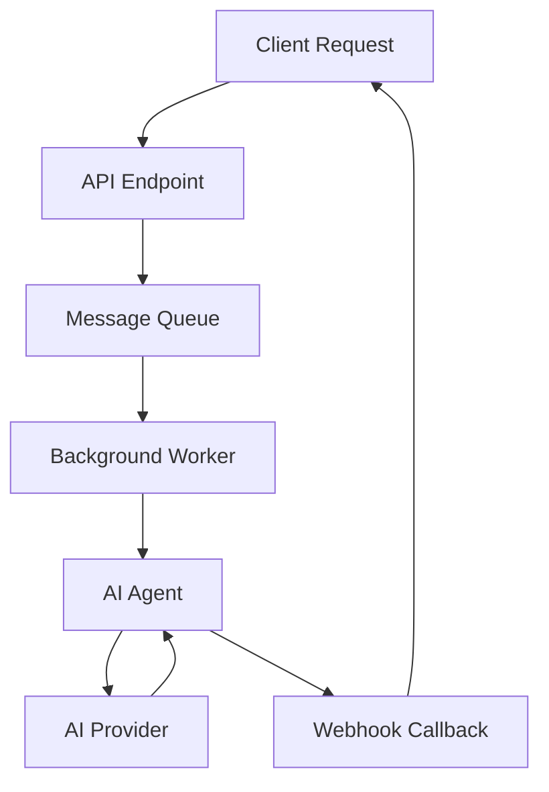
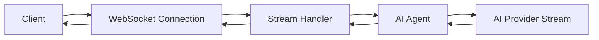
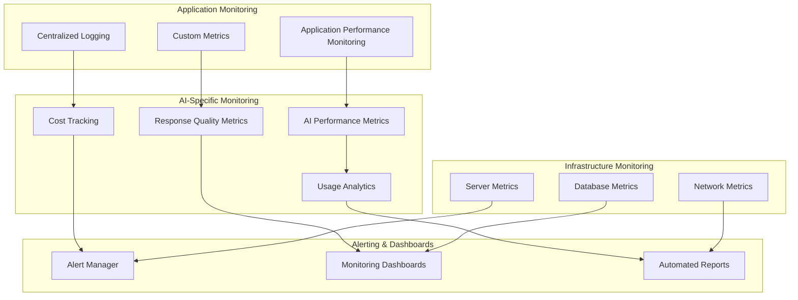
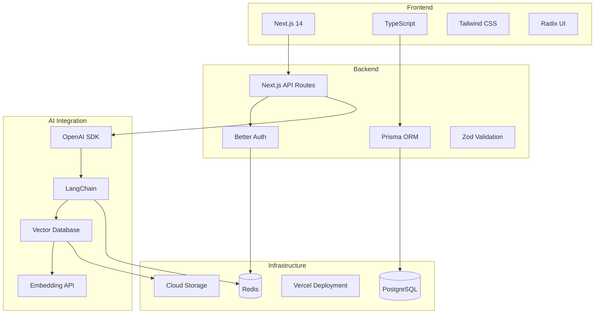

# AI Integration Architecture Diagrams

## System Architecture Overview

## AI Agent Architecture

## Data Flow Architecture

## Security Architecture

## Deployment Architecture

## Integration Patterns

### 1. Synchronous Integration Pattern

### 2. Asynchronous Integration Pattern

### 3. Streaming Integration Pattern

## Monitoring Architecture

## Component Interaction Matrix

| Component | HR Services | AI Providers | Database | Cache | File Storage |
|-----------|-------------|--------------|----------|-------|--------------|
| Agent Manager | ✅ Direct | ✅ Direct | ✅ Via ORM | ✅ Direct | ❌ |
| Context Manager | ❌ | ❌ | ✅ Via ORM | ✅ Direct | ❌ |
| AI Router | ❌ | ✅ Direct | ❌ | ✅ Direct | ❌ |
| HR Assistant | ✅ Direct | ✅ Via Router | ✅ Via ORM | ✅ Direct | ❌ |
| Document Agent | ✅ Direct | ✅ Via Router | ✅ Via ORM | ✅ Direct | ✅ Direct |
| Analytics Agent | ✅ Direct | ✅ Via Router | ✅ Via ORM | ✅ Direct | ❌ |

## Technology Stack Mapping

