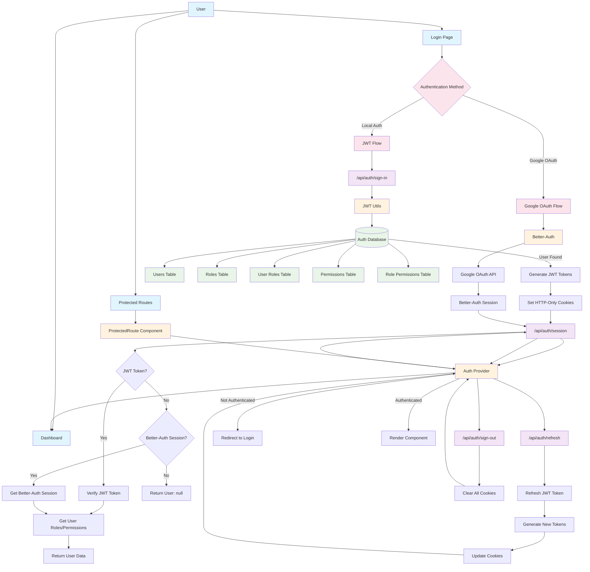
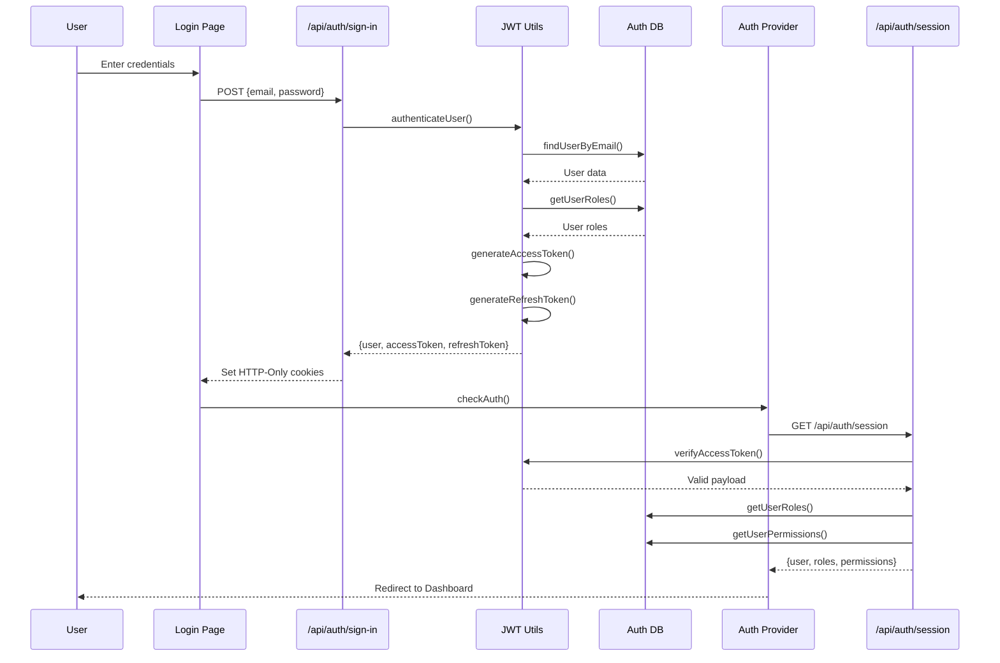
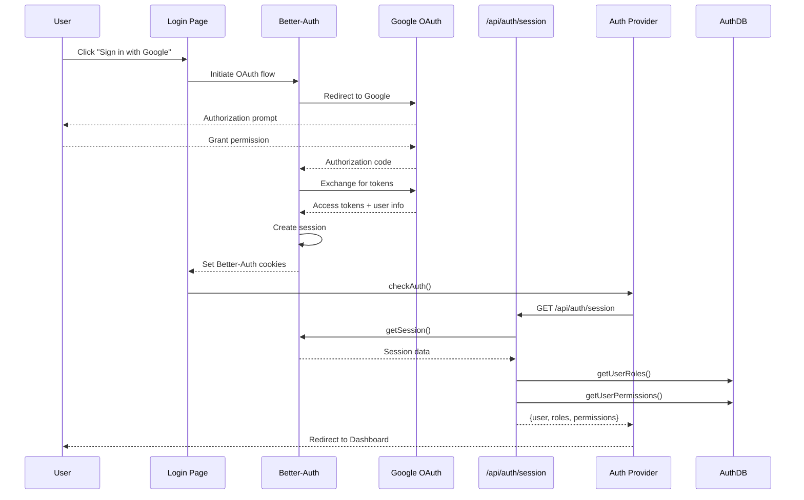
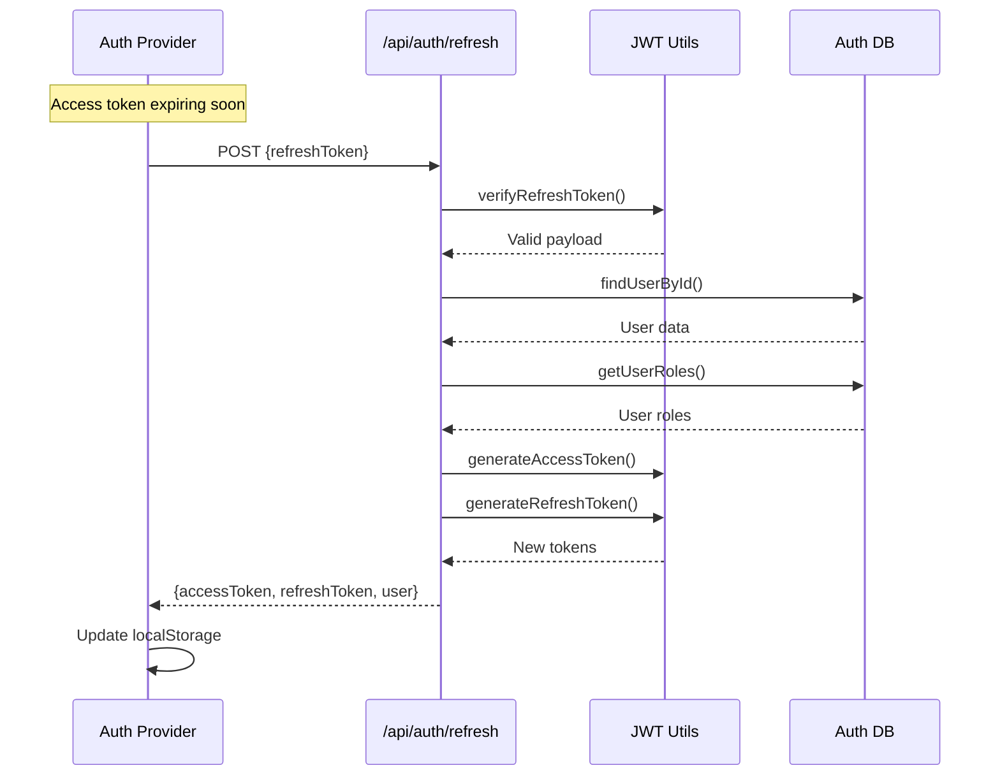
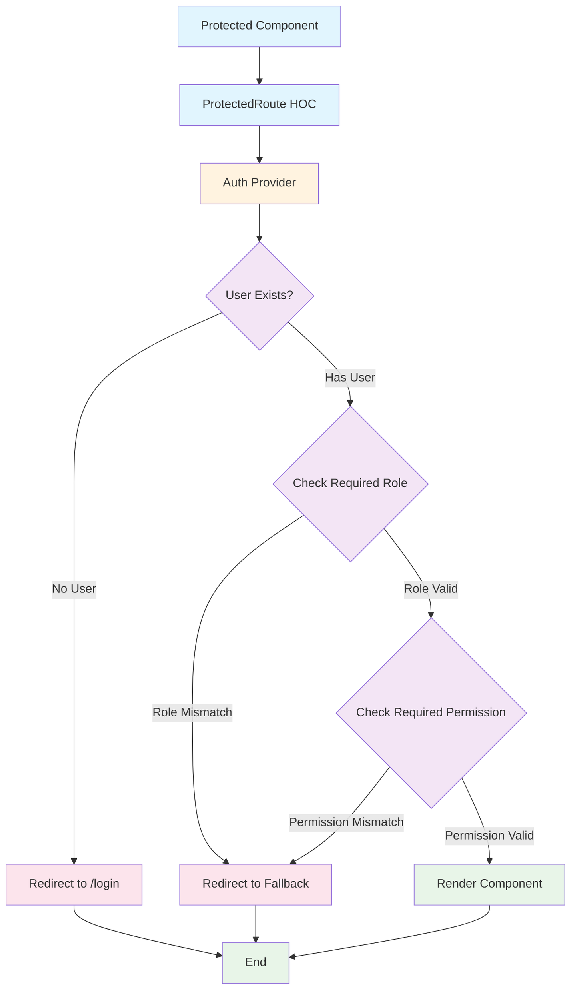
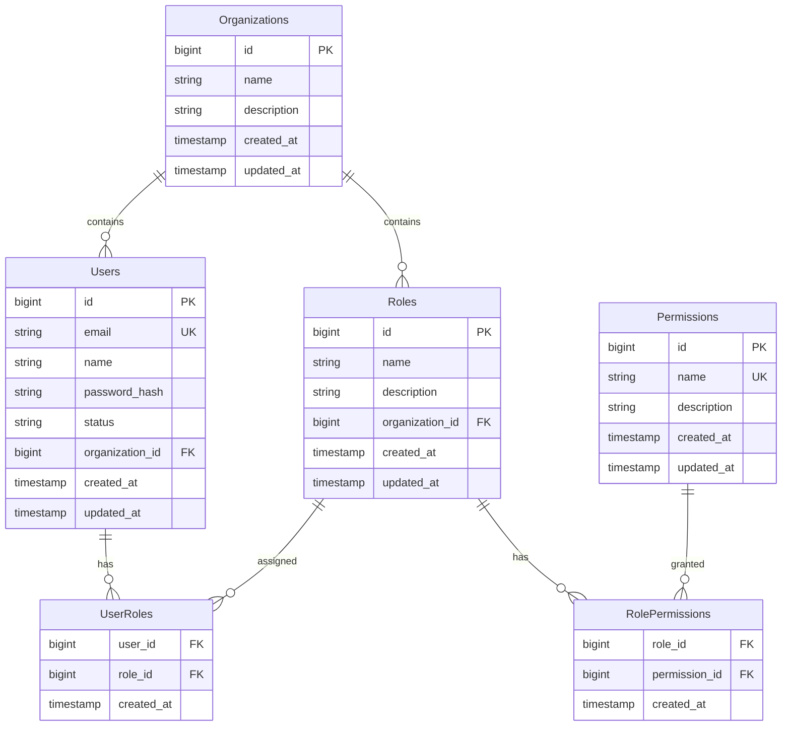

# Authentication Implementation Documentation

## Overview

This document describes the authentication system implementation that supports JWT-based local authentication, Google OAuth, and better-auth integration.

## Architecture Diagram



## JWT Authentication Flow



## Google OAuth Flow



## Token Refresh Flow



## Session Validation Logic

```mermaid
flowchart TD
    Start[/api/auth/session] --> CheckCookies{Check Cookies}
    CheckCookies -->|JWT Token| ValidateJWT[Validate JWT Token]
    CheckCookies -->|No JWT Token| CheckBetterAuth{Check Better-Auth Session}
    
    ValidateJWT -->|Valid| GetUserData[Get User Data]
    ValidateJWT -->|Invalid| ReturnNull[Return User: null]
    
    CheckBetterAuth -->|Valid Session| GetBetterAuthData[Get Better-Auth Data]
    CheckBetterAuth -->|No Session| ReturnNull
    
    GetUserData --> GetRoles[Get Roles/Permissions]
    GetBetterAuthData --> GetRoles
    GetRoles --> ReturnUser[Return User Data]
    ReturnNull --> End[End]
    ReturnUser --> End
    
    classDef api fill:#e1f5fe
    classDef logic fill:#f3e5f5
    classDef success fill:#e8f5e8
    classDef error fill:#ffebee
    
    class Start,CheckCookies,CheckBetterAuth api
    class ValidateJWT,GetUserData,GetBetterAuthData,GetRoles logic
    class ReturnUser,End success
    class ReturnNull error
```

## Protected Route Flow



## Database Schema



## Configuration Summary

### JWT Configuration
- **Access Token**: 15 minutes expiration
- **Refresh Token**: 7 days expiration  
- **Storage**: HTTP-Only cookies + localStorage (refresh only)
- **Algorithm**: HS256 with server secret

### Better-Auth Configuration
- **Session**: 7 days expiration
- **Providers**: Google OAuth, GitHub OAuth
- **Cookie Cache**: 5 minutes
- **Database**: PostgreSQL via Prisma adapter

### Security Features
- HTTP-Only cookies for tokens
- Secure flag in production
- SameSite lax policy
- Automatic token refresh
- Role-based access control (RBAC)
- Permission-based authorization

## File Structure

```
lib/
├── auth.ts              # Better-auth configuration
├── auth/
│   ├── jwt.ts           # JWT utilities
│   ├── auth-db.ts       # Database auth functions
│   └── middleware.ts    # Auth middleware
app/
├── api/auth/
│   ├── sign-in/         # JWT login
│   ├── sign-out/        # Logout endpoint
│   ├── session/         # Session validation
│   └── refresh/         # Token refresh
├── components/
│   ├── providers/
│   │   └── auth-provider.tsx  # React auth context
│   └── protected-route.tsx    # Route protection HOC
└── not-found.tsx        # Generic 404 page
```
