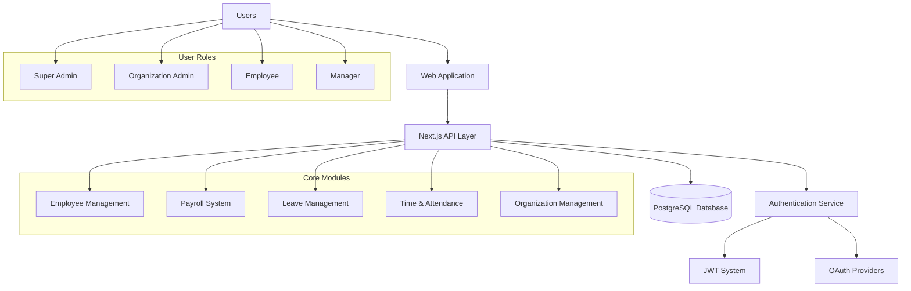

## 1. Project Name
**HR Management System (HRMS)**

## 2. Description
Comprehensive Human Resource Management platform designed for modern organizations:
- **What it does**: Manages employee lifecycle, payroll, leave, attendance, and organizational structure
- **Who it's for**: Small to medium-sized businesses, HR departments, and organizational administrators
- **Why it exists**: To streamline HR operations, ensure compliance, and provide data-driven insights for workforce management

## 3. Goals
- **Centralized Employee Management**: Single source of truth for all employee data and records
- **Automated Payroll Processing**: Accurate salary computation with deductions and compliance
- **Role-Based Access Control**: Secure multi-tenant system with granular permissions
- **Scalable Architecture**: Support for multiple organizations with customizable workflows
- **Compliance & Audit**: Complete audit trail and regulatory compliance features

## 4. High-level Architecture (Mermaid)


```