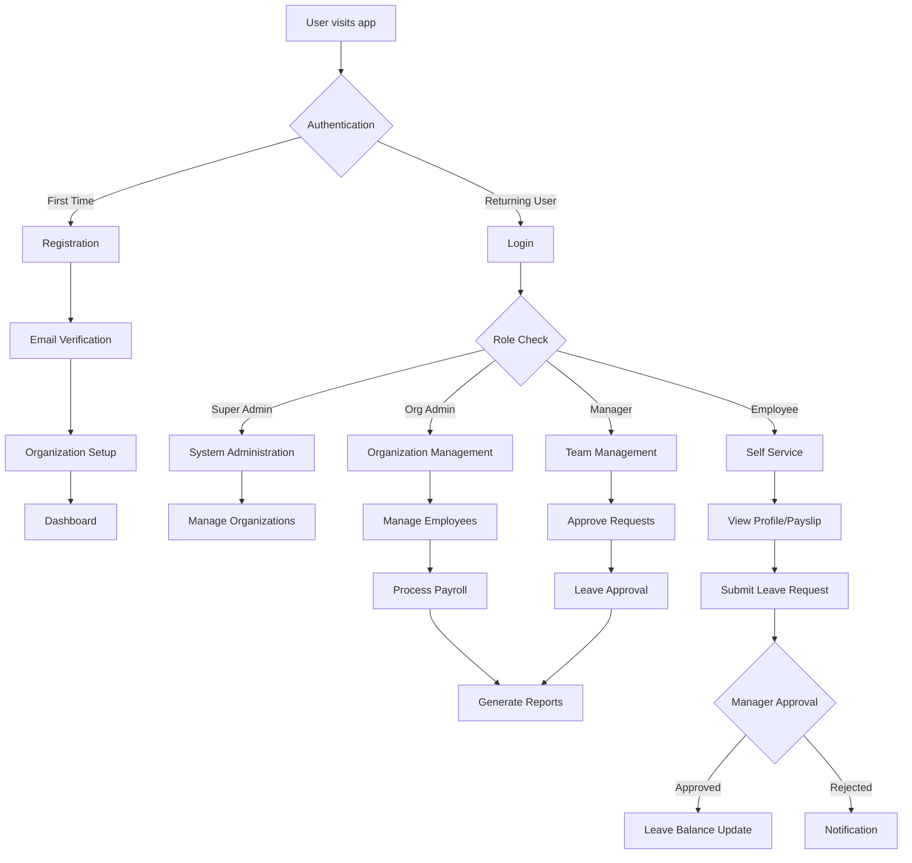

---

# **PAGE 2 — Requirements Specification**

# Requirements Specification

## Functional Requirements

### Authentication & Access Control

| ID     | Requirement                               | Priority | Status |
|--------|-------------------------------------------|----------|--------|
| FR-001 | User can register with email/password     | High     | TODO   |
| FR-002 | User can log in with credentials          | High     | TODO   |
| FR-003 | User can log in with Google OAuth         | High     | TODO   |
| FR-004 | System supports role-based access control | High     | TODO   |
| FR-005 | Admin can manage user permissions         | Medium   | TODO   |
| FR-006 | System enforces session timeout           | Medium   | TODO   |

### Organization Management

| ID     | Requirement                               | Priority | Status | 
|--------|-------------------------------------------|----------|--------|
| FR-007 | Super admin can create organizations      | High     | TODO   |
| FR-008 | Organization admin can manage departments | High     | TODO   |
| FR-009 | System supports multi-tenant architecture | High     | TODO   |
| FR-010 | Admin can configure organization settings | Medium   | TODO   |

### Employee Management
| ID     | Requirement                              | Priority | Status |
|--------|------------------------------------------|----------|--------|
| FR-011 | Admin can add/edit employee profiles     | High     | TODO   |
| FR-012 | System stores employee documents         | High     | TODO   |
| FR-013 | Manager can view team members            | Medium   | TODO   |
| FR-014 | Employee can update personal information | Medium   | TODO   |
| FR-015 | System tracks employment history         | Medium   | TODO   |

### Payroll Management

| ID     | Requirement                           | Priority | Status |
|--------|---------------------------------------|----------|--------|
| FR-016 | System calculates monthly salaries    | High     | TODO   |
| FR-017 | Admin can configure salary components | High     | TODO   |
| FR-018 | System processes statutory deductions | High     | TODO   |
| FR-019 | Employees can view payslips           | Medium   | TODO   |
| FR-020 | System handles overtime calculations  | Medium   | TODO   |

### Leave Management

| ID     | Requirement                        | Priority | Status |
|--------|------------------------------------|----------|--------|
| FR-021 | Employee can submit leave requests | High     | TODO   |
| FR-022 | Manager can approve/reject leave   | High     | TODO   |
| FR-023 | System tracks leave balances       | High     | TODO   |
| FR-024 | Admin can configure leave policies | Medium   | TODO   |
| FR-025 | System generates leave reports     | Medium   | TODO   |

### Time & Attendance

| ID     | Requirement                         | Priority | Status |
|--------|-------------------------------------|----------|--------|
| FR-026 | Employee can clock in/out           | High     | TODO   |
| FR-027 | System calculates work hours        | High     | TODO   |
| FR-028 | Manager can view attendance reports | Medium   | TODO   |
| FR-029 | System supports flexible scheduling | Low      | TODO   |

## Non-Functional Requirements

### Performance
- Page load time: < 3 seconds
- API response time: < 500ms
- Database query time: < 200ms
- Support 1000+ concurrent users

### Security
- JWT-based authentication with refresh tokens
- Role-based access control (RBAC)
- Data encryption at rest and in transit
- Audit trail for all sensitive operations
- OWASP compliance

### Reliability & Availability
- 99.9% uptime target
- Automated backup system
- Disaster recovery procedures
- Error monitoring and alerting

### Scalability
- Multi-tenant architecture
- Horizontal scaling support
- Database connection pooling
- CDN integration for static assets

### Usability
- Responsive design for mobile/desktop
- Intuitive user interface
- Accessibility compliance (WCAG 2.1)
- Multi-language support capability

## User Flow Diagram

## Business Rules

### Leave Policy
- Annual leave: 21 days per year
- Sick leave: 10 days per year
- Carry-over: Max 5 days to next year
- Approval required: 3+ days in advance

### Payroll Rules
- Processing date: Last working day of month
- Overtime rate: 1.5x regular rate
- Tax calculation: Based on local tax brackets
- Probation period: 3 months (80% salary)

### Access Control
- Super Admin: All organizations
- Org Admin: Own organization only
- Manager: Direct reports only
- Employee: Own data only

## Integration Requirements

### External Systems
- Email service provider (SendGrid/Ses)
- Payment gateway for payroll
- Government tax portal integration
- Calendar integration (Google/Outlook)

### APIs
- RESTful API with OpenAPI documentation
- Webhook support for real-time updates
- Rate limiting: 100 requests/minute
- API versioning support

