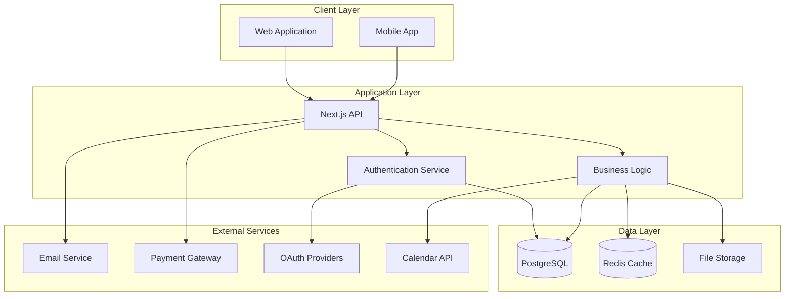
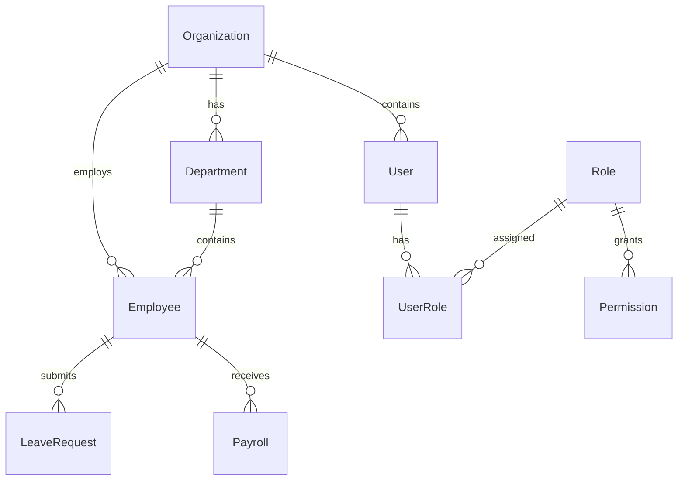

# System Architecture

## High-Level System Diagram

## Technology Stack

### Frontend
* **Framework**: Next.js 15 with App Router
* **Language**: TypeScript
* **Styling**: Tailwind CSS
* **UI Components**: Custom components + shadcn/ui
* **State Management**: React Context + Zustand
* **Forms**: React Hook Form + Zod validation

### Backend
* **Runtime**: Node.js
* **Framework**: Next.js API Routes
* **Authentication**: Better Auth + JWT
* **Validation**: Zod schemas
* **File Upload**: Multer + Cloud storage

### Database
* **Primary**: PostgreSQL 14+
* **ORM**: Prisma
* **Caching**: Redis
* **Connection**: Connection pooling

### Infrastructure
* **Deployment**: Vercel/AWS
* **Monitoring**: Error tracking + Analytics
* **CDN**: Vercel Edge Network
* **Environment**: Docker support

## Architecture Patterns

### Multi-Tenant Architecture
* **Organization-based isolation** using organization_id
* **Row-level security** for data access
* **Shared database** with tenant separation
* **Customizable settings** per organization

### Authentication Flow
* **Dual authentication**: JWT (local) + OAuth (social)
* **Role-based access control (RBAC)**
* **Session management** with refresh tokens
* **Permission-based authorization**

### API Design
* **RESTful APIs** with OpenAPI documentation
* **Versioning support** for backward compatibility
* **Rate limiting** for API protection
* **Error handling** with proper HTTP status codes

## Security Architecture

### Authentication Layers
{code:language=mermaid}
flowchart LR
    User --> AuthLayer
    AuthLayer --> JWTAuth[JWT Validation]
    AuthLayer --> OAuthAuth[OAuth Validation]
    JWTAuth --> RBAC[Role-Based Access Control]
    OAuthAuth --> RBAC
    RBAC --> Permissions[Permission Check]
    Permissions --> Resource[Resource Access]
{code}

### Data Protection
* **Encryption at rest** for sensitive data
* **Encryption in transit** using HTTPS/TLS
* **Password hashing** with bcrypt
* **JWT token** security with proper expiration
* **Audit logging** for all sensitive operations

### Access Control Matrix
| Role        | Organization Access | Employee Access | Payroll Access | System Admin |
|-------------|---------------------|-----------------|----------------|--------------|
| Super Admin | All                 | All             | All            | Full         |
| Org Admin   | Own                 | Own             | Own            | Limited      |
| Manager     | Own                 | Team            | Team           | None         |
| Employee    | Own                 | Own             | Own            | None         |

## Database Architecture

### Schema Design
* **29 tables** with proper relationships
* **Foreign key constraints** for data integrity
* **Indexes** for performance optimization
* **Audit fields** (created_at, updated_at)

### Key Entities

## Performance Architecture

### Caching Strategy
* **Redis caching** for frequently accessed data
* **Session caching** for authentication tokens
* **API response caching** for static data
* **Database query optimization** with proper indexes

### Scalability Design
* **Horizontal scaling** support
* **Load balancing** capabilities
* **Database connection pooling**
* **CDN integration** for static assets

### Monitoring & Observability
* **Application performance monitoring**
* **Error tracking and alerting**
* **Database performance metrics**
* **API response time tracking**

## Integration Architecture

### External System Integrations
* **Email Service** (SendGrid/SES)
* **Payment Gateway** for payroll processing
* **OAuth Providers** (Google, GitHub)
* **Calendar Integration** (Google/Outlook)
* **Government Tax Portal** integration

### API Integration Patterns
* **Webhook support** for real-time updates
* **Batch processing** for payroll operations
* **Scheduled jobs** for automated tasks
* **Event-driven architecture** for notifications

## Deployment Architecture

### Environment Setup
* **Development**: Local development with Docker
* **Staging**: Pre-production testing environment
* **Production**: Scalable cloud deployment

### CI/CD Pipeline
* **Automated testing** on code changes
* **Database migrations** with Prisma
* **Environment-specific configurations**
* **Rollback capabilities** for deployments

## Future Architecture Enhancements

### Microservices Migration Path
* **Authentication Service** separation
* **Payroll Service** isolation
* **Notification Service** decoupling
* **File Management Service** independence

### Advanced Features
* **Event sourcing** for audit trails
* **CQRS pattern** for read/write separation
* **GraphQL API** for flexible queries
* **Mobile API** optimization

---

**Architecture Principles:**
* **Security First** - All layers designed with security in mind
* **Scalability** - Built to grow with organization needs
* **Maintainability** - Clean, documented, and testable code
* **Performance** - Optimized for speed and efficiency
* **Flexibility** - Adaptable to changing business requirements