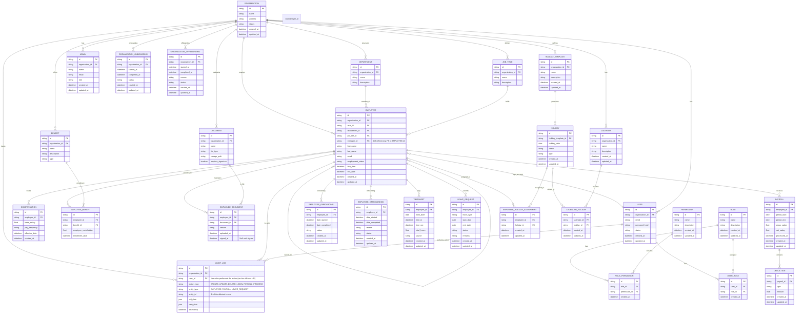

```mermaid
erDiagram
    ORGANIZATION {
        string id PK
        string name
        string address
        string status
        datetime created_at
        datetime updated_at
    }

    DEPARTMENT {
        string id PK
        string organization_id FK
        string name
        string description
    }

    JOB_TITLE {
        string id PK
        string organization_id FK
        string name
        string description
    }

    USER {
        string id PK
        string organization_id FK
        string email
        string password_hash
        string status
        datetime created_at
        datetime updated_at
    }

    EMPLOYEE {
        string id PK
        string organization_id FK
        string user_id FK
        string department_id FK
        string job_title_id FK
        string manager_id FK "Self-referencing FK to EMPLOYEE.id"
        string first_name
        string last_name
        string email
        string employment_status
        datetime hire_date
        datetime exit_date
        datetime created_at
        datetime updated_at
    }

    COMPENSATION {
        string id PK
        string employee_id FK
        float base_salary
        string pay_frequency
        datetime effective_date
        datetime created_at
    }

    BENEFIT {
        string id PK
        string organization_id FK
        string name
        string description
        string type
    }

    EMPLOYEE_BENEFIT {
        string id PK
        string employee_id FK
        string benefit_id FK
        float employee_contribution
        datetime enrollment_date
    }
    
    DOCUMENT {
        string id PK
        string organization_id FK
        string name
        string file_type
        string storage_path
        boolean requires_signature
    }

    EMPLOYEE_DOCUMENT {
        string id PK
        string employee_id FK
        string document_id FK
        string version
        datetime uploaded_at
        datetime signed_at "Null until signed"
    }

    AUDIT_LOG {
        string id PK
        string organization_id FK
        string user_id FK "User who performed the action (can be offshore HR)"
        string action_type "CREATE, UPDATE, DELETE, LOGIN, PAYROLL_PROCESS"
        string entity_type "EMPLOYEE, PAYROLL, LEAVE_REQUEST"
        string entity_id "ID of the affected record"
        json old_data
        json new_data
        datetime timestamp
    }
    
    ROLE {
        string id PK
        string name
        string description
        datetime created_at
        datetime updated_at
    }

    PERMISSION {
        string id PK
        string name
        string description
        datetime created_at
        datetime updated_at
    }

    USER_ROLE {
        string id PK
        string user_id FK
        string role_id FK
        datetime created_at
    }

    ROLE_PERMISSION {
        string id PK
        string role_id FK
        string permission_id FK
        datetime created_at
    }

    ADMIN {
        string id PK
        string organization_id FK
        string name
        string email
        string role
        datetime created_at
        datetime updated_at
    }

    EMPLOYEE_ONBOARDING {
        string id PK
        string employee_id FK
        datetime date_started
        datetime date_completed
        string status
        datetime created_at
        datetime updated_at
    }

    EMPLOYEE_OFFBOARDING {
        string id PK
        string employee_id FK
        datetime date_started
        datetime date_completed
        string reason
        string status
        datetime created_at
        datetime updated_at
    }

    ORGANIZATION_ONBOARDING {
        string id PK
        string organization_id FK
        datetime started_at
        datetime completed_at
        string status
        datetime created_at
        datetime updated_at
    }

    ORGANIZATION_OFFBOARDING {
        string id PK
        string organization_id FK
        datetime started_at
        datetime completed_at
        string reason
        string status
        datetime created_at
        datetime updated_at
    }

    TIMESHEET {
        string id PK
        string employee_id FK
        date work_date
        datetime time_in
        datetime time_out
        float total_hours
        string source
        datetime created_at
        datetime updated_at
    }

    LEAVE_REQUEST {
        string id PK
        string employee_id FK
        string leave_type
        date start_date
        date end_date
        string status
        string remarks
        datetime created_at
        datetime updated_at
    }

    PAYROLL {
        string id PK
        string employee_id FK
        date period_start
        date period_end
        float gross_salary
        float net_salary
        datetime processed_at
        datetime created_at
        datetime updated_at
    }

    DEDUCTION {
        string id PK
        string payroll_id FK
        string type
        float amount
        datetime created_at
        datetime updated_at
    }

    HOLIDAY_TEMPLATE {
        string id PK
        string organization_id FK
        string name
        string description
        datetime created_at
        datetime updated_at
    }

    HOLIDAY {
        string id PK
        string holiday_template_id FK
        date holiday_date
        string name
        string type
        datetime created_at
        datetime updated_at
    }

    EMPLOYEE_HOLIDAY_ASSIGNMENT {
        string id PK
        string employee_id FK
        string holiday_id FK
        datetime created_at
        datetime updated_at
    }

    CALENDAR {
        string id PK
        string organization_id FK
        string name
        string description
        datetime created_at
        datetime updated_at
    }

    CALENDAR_HOLIDAY {
        string id PK
        string calendar_id FK
        string holiday_id FK
        datetime created_at
        datetime updated_at
    }

    USER ||--o{ USER_ROLE : has
    ROLE ||--o{ USER_ROLE : assigned
    ROLE ||--o{ ROLE_PERMISSION : has
    PERMISSION ||--o{ ROLE_PERMISSION : includes
    EMPLOYEE }o--|| USER : login_account

    ORGANIZATION ||--o{ USER : has
    ORGANIZATION ||--o{ EMPLOYEE : employs
    ORGANIZATION ||--o{ ADMIN : has
    ORGANIZATION ||--o{ HOLIDAY_TEMPLATE : defines
    ORGANIZATION ||--o{ CALENDAR : has
    ORGANIZATION ||--o{ DEPARTMENT : structures
    ORGANIZATION ||--o{ JOB_TITLE : defines
    ORGANIZATION ||--o{ DOCUMENT : maintains
    ORGANIZATION ||--o{ ORGANIZATION_ONBOARDING : onboarding
    ORGANIZATION ||--o{ ORGANIZATION_OFFBOARDING : offboarding
    ORGANIZATION ||--o{ AUDIT_LOG : tracks
    ORGANIZATION ||--o{ BENEFIT : offers

    EMPLOYEE ||--o{ TIMESHEET : logs
    EMPLOYEE ||--o{ LEAVE_REQUEST : submits
    EMPLOYEE ||--o{ PAYROLL : receives
    EMPLOYEE ||--o{ EMPLOYEE_ONBOARDING : onboarding
    EMPLOYEE ||--o{ EMPLOYEE_OFFBOARDING : offboarding
    EMPLOYEE ||--o{ COMPENSATION : tracks
    EMPLOYEE ||--o{ EMPLOYEE_BENEFIT : enrolled_in
    EMPLOYEE ||--o{ EMPLOYEE_DOCUMENT : maintains
    EMPLOYEE ||--o{ EMPLOYEE_HOLIDAY_ASSIGNMENT : assigned_to
    EMPLOYEE }o--o{ EMPLOYEE : reports_to "via manager_id"
    EMPLOYEE ||--o{ AUDIT_LOG : is_actor

    DEPARTMENT ||--o{ EMPLOYEE : member_of
    JOB_TITLE ||--o{ EMPLOYEE : holds

    PAYROLL ||--o{ DEDUCTION : contains

    HOLIDAY_TEMPLATE ||--o{ HOLIDAY : generates
    HOLIDAY ||--o{ CALENDAR_HOLIDAY : added_to
    HOLIDAY ||--o{ EMPLOYEE_HOLIDAY_ASSIGNMENT : assigned_to

    CALENDAR ||--o{ CALENDAR_HOLIDAY : includes
    
    DOCUMENT ||--o{ EMPLOYEE_DOCUMENT : is_file
    BENEFIT ||--o{ EMPLOYEE_BENEFIT : enrollment

    USER ||--o{ AUDIT_LOG : performs_action
```