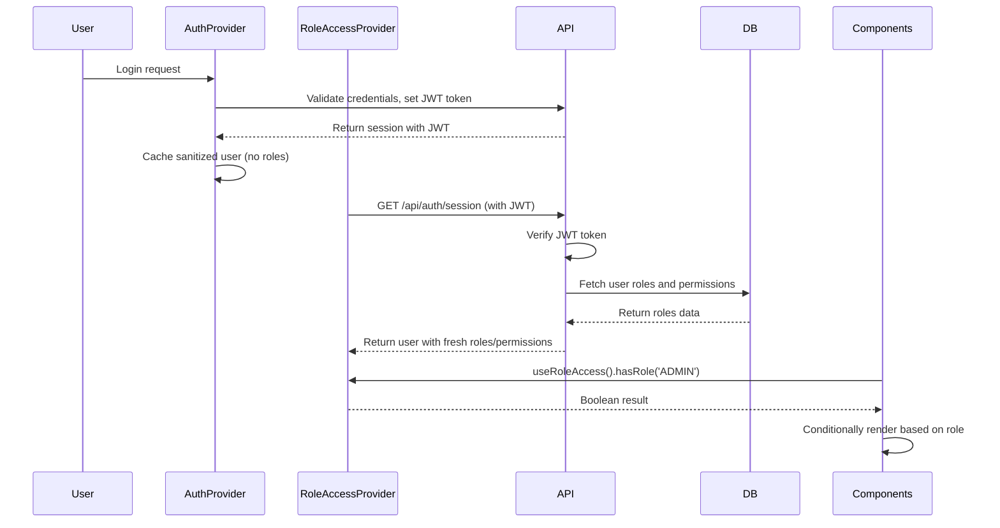

# Security Changes: Role Access Implementation

## Overview
Implemented comprehensive security enhancements to eliminate client-side caching of sensitive role and permission data, ensuring all access control decisions are validated server-side with fresh data.

## Key Changes

### 1. Auth Provider Modifications
- **Removed Sensitive Data from Cache**: Updated `User` interface and sanitization logic in `auth-provider.tsx` and `useUserCache.ts` to exclude `roles` and `permissions` from cached user objects.
- **Sanitized User Storage**: Modified login, token refresh, and cross-tab sync to store only safe user fields (`id`, `email`, `username`, `organization_id`).
- **Impact**: Prevents browser dev tool tampering with cached role data.

### 2. Role Access Provider Creation
- **New Context Provider**: Created `RoleAccessProvider` in `/app/components/providers/role-access-provider.tsx` to centralize role fetching and access checking.
- **Secure Fetching**: Fetches roles and permissions directly from `/api/auth/session` with no-cache headers to ensure fresh, uncached data.
- **API Call**: Makes a server request to `/api/auth/session` on user authentication state changes (not on every render), retrieving validated roles and permissions.
- **Functions Provided**: `hasRole`, `hasAnyRole`, `hasAllRoles`, `hasPermission`, `hasAnyPermission` for component use.

### 3. Component Updates
- **AppSidebar**: Updated to use `useRoleAccess()` instead of cached user roles, filtering nav items based on server-validated roles.
- **RoleComponentWrapper**: Refactored to consume `RoleAccessProvider` context, eliminating duplicate role fetching logic.
- **Provider Hierarchy**: Added `RoleAccessProvider` to app layout inside `AuthProvider` for global availability.

### 4. API Consolidation
- **Removed Duplicate Endpoint**: Deleted `/api/auth/roles` as it duplicated logic already present in `/api/auth/session`.
- **Session API Utilization**: Leveraged existing `/api/auth/session` endpoint which includes role and permission fetching with JWT validation.

## Security Benefits
- **No Client-Side Role Caching**: Roles cannot be inspected or modified in browser storage/memory.
- **Fresh Validation**: Each role check triggers server-side validation through JWT verification.
- **Tamper Resistance**: Eliminates attack vectors via dev tools or local storage manipulation.

## Performance Notes
- **Network Overhead**: Additional API call to session endpoint on user state changes.
- **Caching Strategy**: No browser caching of role data; server responses are fresh.
- **Loading States**: Components show loading during role fetches for better UX.

## API Call Details
- **Endpoint**: `GET /api/auth/session`
- **Frequency**: Called when user authenticates or auth state changes (not per render).
- **Headers**: Includes `Cache-Control: no-cache` and `Pragma: no-cache` to prevent any caching.
- **Response**: Returns user object with `roles` and `permissions` arrays after JWT validation.
- **Validation**: Inherits auth provider's JWT verification logic for security consistency.

## Session Retrieval and Component Validation Flow

These changes ensure all role-based UI rendering and access control is backed by server-validated, non-cacheable data.
